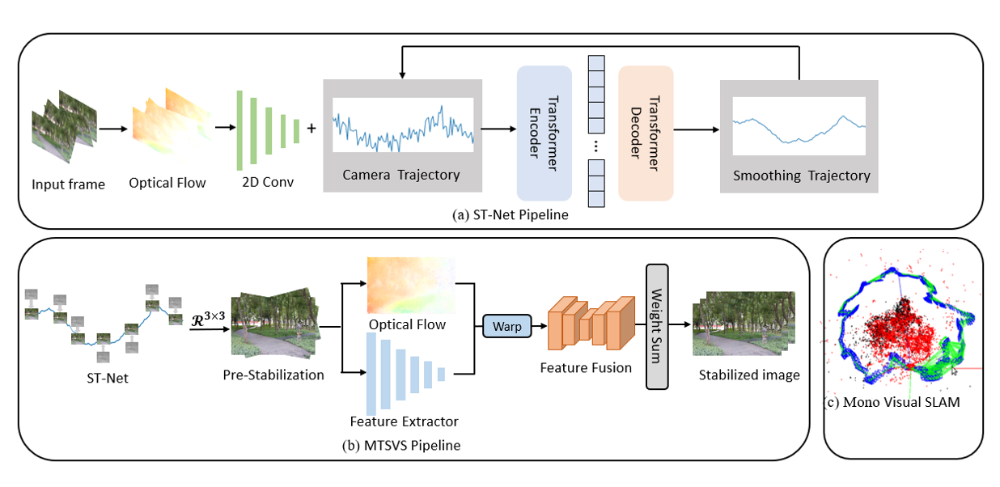

# HuKIS-SLAM: Humanoid Kinematics-Integrated Image Stabilized SLAM System



Currently, humanoid robots executing various tasks experience significant image jitter due to bipedal movement, leading to image blur and dramatic changes in camera perspectives. We propose a novel multimodal model called HuKIS-SLAM. This model employs our designed ST-Net for motion smoothing, which stabilizes the input images in advance, and then inputs them into the convolutional neural network MTSVS to fuse them into highly stable frames. Our key innovation lies in integrating head pose learning for humanoid robots, effectively mitigating the effects caused by inaccurate optical flow and fast-moving objects. Extensive experiments on both virtual and real-world datasets demonstrate the advantages of our method over other Visual SLAM approaches.

## Setup

Setup environment for [Yu and Ramamoorthi 2020].
```
cd HuKIS-SLAM
conda create --name MTSVS python=3.6
conda activate MTSVS
pip install -r requirements_MTSVS.txt
./install.sh
```

Download pre-trained checkpoints of [Yu and Ramamoorthi 2020].
```
wget https://www.cmlab.csie.ntu.edu.tw/~yulunliu/FuSta/CVPR2020_ckpts.zip
unzip CVPR2020_ckpts.zip
cd ..
```
Setup environment for HuKIS-SLAM.
```
conda deactivate
conda create --name HuKIS python=3.6
conda activate HuKIS
conda install pytorch=1.6.0 torchvision=0.7.0 cudatoolkit=10.1 -c pytorch
conda install matplotlib
conda install tensorboard
conda install scipy
conda install opencv
conda install -c conda-forge cupy cudatoolkit=10.1
pip install PyMaxflow
```

## Data Preparation
Download dataset for training and test [here](https://github.com/TuSimple/tusimple-benchmark). Uncompress HRReal.zip and move HRReal folder under the HuKIS folder.

We expect the directory structure to be the following:
### HRReal:
```
HRReal/
    IMG10_0001/
        GT/
          00000.jpg
          00001.jpg
          00002.jpg
          ...
        frame_6dof.csv

```

## Training

If you don't want to use the Blur processing module, please set "inference_with_frame_selection": 0)

```
python train.py --out_dir output_noProxy_poolingWithMask_decoderWithMask  --pooling_with_mask 1 --decoder_with_mask 1 --decoder_with_gated_conv 1 --center_residual_detail_transfer 0 --pooling_with_center_bias 1 --residual_detail_transfer 1 --pooling_type CNN_flowError --gumbel 0 --train ./DataSet_Real --test_input ./DataSet_Real

```
* Visualized images are in ./output_noProxy_poolingWithMask/result during training.
* Saved model weight are in ./output_noProxy_poolingWithMask/result/checkpoint files during training.

## Running code

Calculate smoothed flow using [Yu and Ramamoorthi 2020].
```
conda activate MTSVS
cd CVPR2020CODE_MTSVS_modified
python main.py ../input_frames/ ../CVPR2020_output/ ../CVPR2020_warping_field/
```

Run HuKIS-SLAM video stabilization.
```
conda deactivate
conda activate HuKIS
cd ..
cd HuKIS-SLAM
python run_HuKIS.py --load  HuKIS-SLAM/all_checkpoint/model_epoch050.pth --input_frames_path input_frames/ --warping_field_path CVPR2020_warping_field/ --output_path output/ --temporal_width 41 --temporal_step 4
```

## Acknowledgements

[Yu and Ramamoorthi 2020](http://jiyang.fun/projects.html)

[FuSta](https://alex04072000.github.io/FuSta/)

[DVS](https://zhmeishi.github.io/dvs/)


